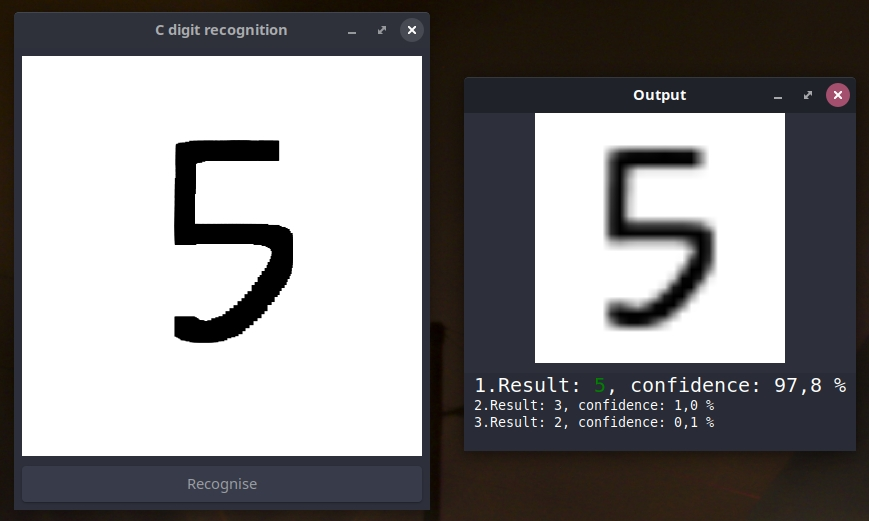

# C-digit-recognition
Handwritten digits recognition in C using neural network trained using [MNIST database](http://yann.lecun.com/exdb/mnist/).

# Installation

## Linux

### Binary package
`.AppImage` file is available under release section.

### Compilation from source
- `sudo apt install libopenblas-dev` - installs OpenBLAS library
- `sudo apt install libgtk-3-dev` - installs
- compilation:
	- use `cd src && make clean && make main && ./main` to run normal compilation
	- use `make clean && make release` to generate AppImage binary (you have to install `linuxdeploy` and other dependecies using `make install_tools` first)

# GUI

## Control
- `left mouse button & drag` to draw
- `right mouse button` to clear the draw space
- `middle mouse button or Recognise button in the GUI` to run recognition process

## Processing of the drawn image
Preprocessing used in [MNIST](http://yann.lecun.com/exdb/mnist/) database: *The original black and white (bilevel) images from NIST were size normalized to fit in a 20x20 pixel box while preserving their aspect ratio. The resulting images contain grey levels as a result of the anti-aliasing technique used by the normalization algorithm. the images were centered in a 28x28 image by computing the center of mass of the pixels, and translating the image so as to position this point at the center of the 28x28 field.*

1. **crop calculation** - crop of the whole draw space is calculated from sides until it reaches non white pixels. After that maximum of the width & height of the cropped image is then taken and `crop_x` & `crop_y` & `crop_w` & `crop_h` is recalculated to preserve image ratio.
2. **sub image generation** - using previous values and drawn image stored in pixbuf sub image is created
3. **scaling** - previous cropped image is scaled to the `20x20` image
4. **conversion into grayscale** - pixbuf is converted into `uint8_t` grayscale image
5. **adding frame** - `4, 4, 4, 4` frame is added to the `20x20` image resulting into `28x28` image
6. **computation of the center of mass of the pixels** - is done using mean values accross X & Y
7. **move of the submatrix** - submatrix (drawn number) is moved in the framed image
8. **neural network forward propagation** - this preprocessed image is fed to the neural network

# Libraries
Dependency of the libraries is in this order: `GUI -> ceural -> lag`. For documentation see source code or use IDE (for example vscode).

 - `lag` - [Linear Algebra library](#Lag)
 - `ceural` - [C neural network library](#Ceural)

## Lag
Library supports many operations but more development is needed because currently uses [OpenBLAS](https://github.com/xianyi/OpenBLAS) only for matrix multiplication and matrix transposition.

### Naming
- `mat` - stands for matrix
- `ew` - stands for element wise

### Notes
- Matrix part of the library automatically checks if destination and source is same where shouldn't be same and warns using `assert()`.

## Ceural
Ceural library is created for multi-layer networks trained using MNIST dataset but with small modifications it can be used for other datasets too. See [Accuracy](#Accuracy) for more info.

# Accuracy
After `10` epochs of training with batch size `32` the test set accuracy is `97.47 %` which is not bad considering the test error rate in [MNIST database website](http://yann.lecun.com/exdb/mnist/) of the 2-layer NN. Sadly accuracy is not as good in practice as it's in the test data set 🥺.

Accuracy is calculated using formula [`accuracy = (TP+TN)/(TP+TN+FP+FN)`](https://en.wikipedia.org/wiki/Accuracy_and_precision) which is `accuracy = correct/total`

# Performance
Even though Python is much slower than C, Python-digit-recognition is faster. The reason behind it is that Python version uses great library NumPy, which is perfectly optimized.

# ToDo
- [ ] add `lag` tests
- [ ] add `ceural` tests
- [ ] Use BLAS (for example [OpenBLAS](https://github.com/xianyi/OpenBLAS)) library for linear algebra in more functions to improve speed
- [ ] Add icons into `gui`
- [ ] Add command line options to train & test & save & load NN
- [ ] Create `lag` & `ceural` docs
- [ ] Choose license
- [ ] Create Windows compilation script & test it on Windows
- [x] Center digit by center of mass of the pixels before feeding it to the neural network from GUI input
- [ ] Look into possible accuracy improvements

# Resources
- [MNIST database](http://yann.lecun.com/exdb/mnist/)
- [George Hotz's AI notebook](https://github.com/geohot/ai-notebooks/blob/master/mnist_from_scratch.ipynb)
- [Michael Nielsen's book about neural networks and deep learning](http://neuralnetworksanddeeplearning.com/chap2.html)
- [Artcile about backpropagation from Brilliant.org](https://brilliant.org/wiki/backpropagation/)
- [Epoch vs Batch Size vs Iterations](https://towardsdatascience.com/epoch-vs-iterations-vs-batch-size-4dfb9c7ce9c9)